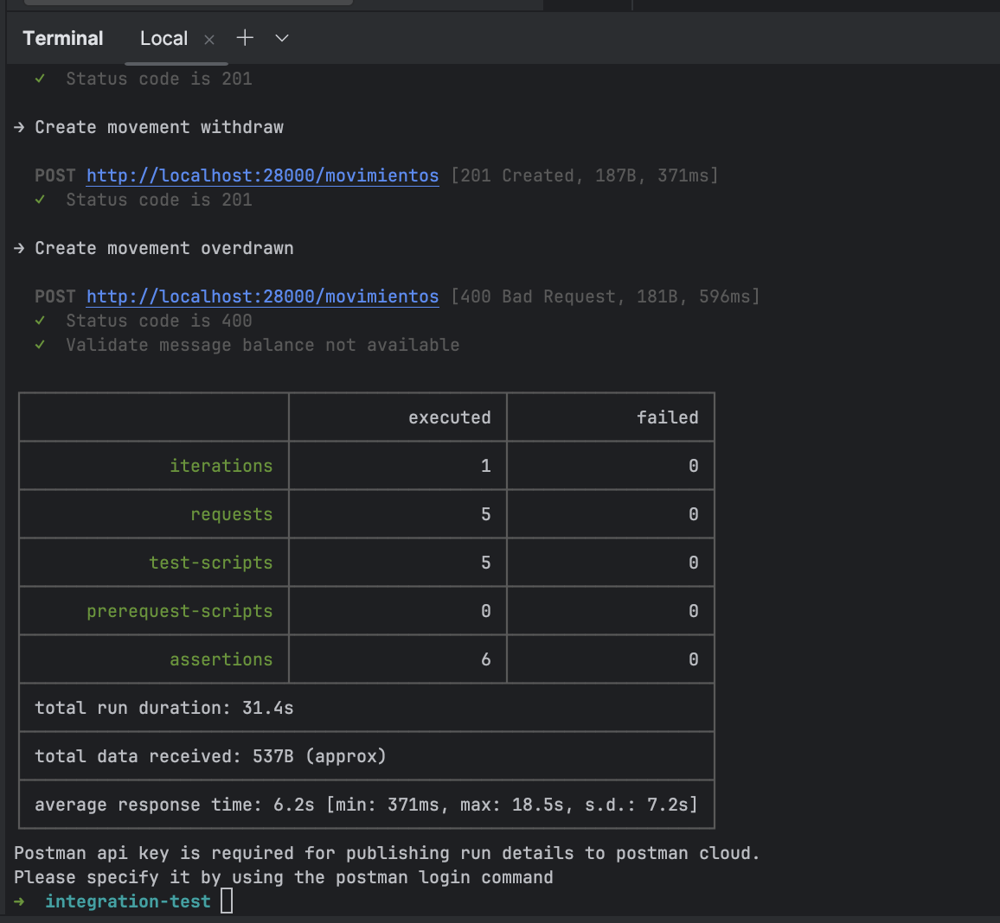

# API CLOUD BANK

<!-- TOC -->

* [API CLOUD BANK](#api-cloud-bank)
    * [Overview](#overview)
    * [Development](#development)
        * [Architecture](#architecture)
        * [Requirements](#requirements)
        * [Running the project](#running-the-project)
        * [Running the integration tests](#running-the-integration-tests)

<!-- TOC -->

## Overview

This project is a RESTful API that simulates a bank system. It has the following features:

- **Client**: It must handle an entity that inherits from the person class.
- **Account**: It must handle an entity.
- **Movements**: It must handle an entity.

## Development

### Architecture

The project is divided into the following layers:

- **Controller**: It is responsible for receiving the requests and returning the responses.
- **Service**: It is responsible for the business logic.
- **Repository**: It is responsible for the database operations.
- **Model**: It is responsible for the entities.
- **DTO**: It is responsible for the data transfer objects.
- **Exception**: It is responsible for the exceptions.
- **Configuration**: It is responsible for the configurations.
- **Integration**: It is responsible for the integration tests.
- **Postman**: It is responsible for the postman collection tests.
- **Docker**: It is responsible for the docker configurations.
- **Makefile**: It is responsible for the project commands.
- **Docker Compose**: It is responsible for the docker-compose configurations.
- **Postman Collection**: It is responsible for the postman collection tests.
- **Postman Environment Variables**: It is responsible for the postman environment

### Requirements

- Make
- Docker
- Docker Compose
- Java 21
- Postman CLI

### Running the project

To run the project, you must execute the following command:

```bash
make deploy
```

### Running the integration tests

Each microservice has a set of integration test HTTP files:

- /api-cloud-bank-accounts/requests
- /api-cloud-bank-clients/requests

To run the integration tests, you must execute the following command:

```bash
make integrationTest
```

This command execute postman collection tests.



### Running Karate tests

To run the Karate tests, change manually the file `api-cloud-bank-clients/src/test/java/com/cloud/bank/clients/karate/Cliente2eTest.java` and remove tag `@Disabled`.

This test how dependency required of docker compose is `up`.

### Report movements

To get the report of movements, you must review the following endpoint request:

```text
api-cloud-bank-movements/requests/endpoints.http

...
### Get report movements
...

```

Powered by [sercheo87](https://github.com/sercheo87)
